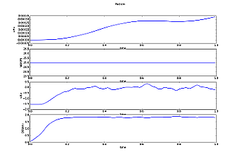
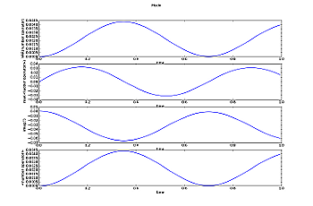
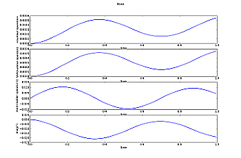

========
Tutorial
========

Introduction
============

PyCppQED is a python library that helps working with `CppQED`_ - a framework
simulating open quantum dynamics written in C++. Since C++ is not the favorite
programming language of everyone, PyCppQED extends this framework with useful
functionality:

 * Import of C++QED output files into python.
 * Conversion C++QED output files to `Matlab`_ *.mat* files.
 * Fast and easy visualization of imported data.
 * Generating arbitrary initial condition vectors for C++QED. (Not yet
   implemented)

Installation
============

It's neither possible nor necessary to install PyCppQED. Just take care that
the base directory (where the setup.py file lives) is on your PYTHONPATH. 
Optionally there is a C extension which speeds up importing C++QED output
files. To get this extension working go to the base directory and type::

    python setup.py build

This will compile the extension file and save it to a path like
*build/lib.linux-i686-2.6/cdata.so* relative to the base directory. Copy this
file into the pycppqed directory and enjoy the speed.

Usage
=====

All following commands assume that PyCppQED is already imported::

    >>> import pycppqed

Split up C++QED output file into standard output and state vectors
------------------------------------------------------------------

When a C++QED script is invoked using the :option:`svdc` argument state vectors are
written into the output file between the calculated expectation values. With
PyCppQED it's easy to extract the state vectors into own files and getting a
standard C++QED output file.

Everytime you want to read somthing from a C++QED output file you will need
a :class:`CppqedOutputReader` instance::

    >>> reader = pycppqed.CppqedOutputReader("ring.dat")

As argument the reader takes the path to an output file. Writing the new
files is easy using the :meth:`saveascii` method::

    >>> reader.saceascii("ring")

This writes the standard output file to :file:`ring` and the statevectors into
separate files named :file:`ring_time.sv` where :token:`time` is substituted
by the time when this state vector was reached.

Convert C++QED output file into *.mat* file
-------------------------------------------

If you want to use `Matlab`_ or `Octave`_ for further processing of the data
you can use PyCppQED to convert a C++QED output file into a *.mat* file.
Again, we have to create a reader object::
    
    >>> reader = pycppqed.CppqedOutputReader("ring.dat")

To convert the given file into a *.mat* file we can use the :meth:`savemat`
method::

    >>> reader.savemat("ring")

This command will write the expectation values into a file named
:file:`ring.mat` and all state vectors together into a single file called
:file:`ring.sv.mat`. The state vectors in the second file are named
:obj:`sv_time` where :token:`time` is replaced by the time when the specific
state vector was reached (Dots in the time value are replaced by an
underscore).

If you prefer to write every state vector into a separate file you can use the
:obj:`split` argument::

    >>> reader.savemat("ring", split=True)

This will create multiple files for the state vectors named
:file:`ring_time.sv.mat` where time is replaced as usual.

.. _import2python:

Import C++QED output file into python
-------------------------------------

Again we need a reader instance::

    >>> reader = pycppqed.CppqedOutputReader("ring.dat")

Converting the data stored in this file is done by the :meth:`convert2python`::

    >>> traj, svs = reader.convert2python()

This method returns two objects which represent the whole information stored
in the C++QED output file:

 * A Trajectory instance which holds all generated expectation values.

 * A list of state vectors stored in instances of the :class:`StateVector`
   class.

Visualization
-------------

There are some convenient shortcuts to visualize the data using 
`matplotlib`_. Assuming you imported the data as in :ref:`import2python` using
the :meth:`plot` of :obj:`traj` plots some beautiful graphs::

    >>> traj.plot()

Using Trajectory and StateVector classes for further calculations
-----------------------------------------------------------------

.. _CppQED: http://sourceforge.net/projects/cppqed/
.. _Matlab: http://www.mathworks.com/
.. _Octave: http://www.gnu.org/software/octave/
.. _matplotlib: http://matplotlib.sourceforge.net/
